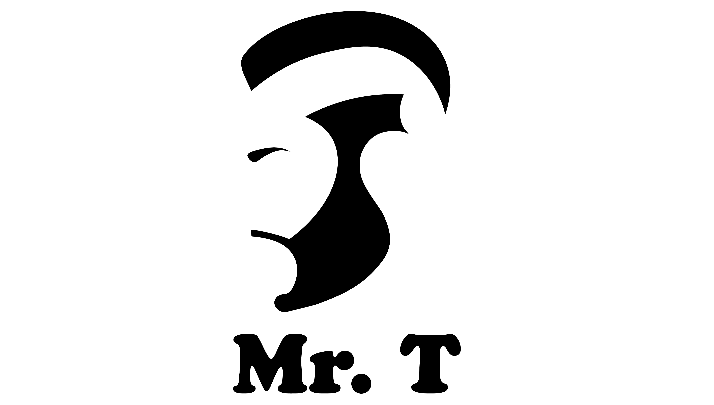

[](https://www.npmjs.com/package/mrt) [](https://github.com/FreeAllMedia/mrt.git/blob/master/LICENSE)  [](https://travis-ci.org/FreeAllMedia/mrt) [](https://coveralls.io/github/FreeAllMedia/mrt?branch=master) [](https://codeclimate.com/github/FreeAllMedia/mrt) [](https://www.bithound.io/github/FreeAllMedia/mrt) [](https://david-dm.org/FreeAllMedia/mrt?theme=shields.io) [](https://david-dm.org/FreeAllMedia/mrt?theme=shields.io#info=devDependencies) [](https://www.npmjs.com/package/mrt) 

# Overview

MrT is a tool for making simple and complex chained interfaces on javascript libraries.

The resulting syntax is supremely easy-to-read while still being flexible and 100% [vanilla-js](https://vanilla-js.org).

# Installation

The easiest and fastest way to install MrT is through the `node package manager`:

``` shell
$ npm install mrt --save
```

# API Guide

**Note:** In each of the following examples we're going to use MrT to build the programmatic interface for a game backend, however it is a generic tool and works just as well for non-game-related projects.

Each function has an associated example that is split into two files:

* `app.js` uses the interface defined in `game.js`.
* `game.js` defines the interface that is used in `app.js`

## `.parameters`

In this simple example, we'

``` javascript
// app.js

import Game from "./game.js";

const game = new Game("Robots vs Aliens")

.army("Robots")
.army("Sluggoids");

game.army().should.eql(["Robots", "Sluggoids"]);
```

``` javascript
// game.js

import ChainLink from "mrt";

class Game extends ChainLink {
  initialize(name) {
    this.parameters("name");
    this.parameters("army").aggregate;

    this.name(name);
  }
}

export default Game;
```

**Object-Oriented Chained Interfaces**

``` javascript
// app.js

import Game from "./game.js";

const game = new Game("Robots vs Aliens")

.army("Robots")
  .workers(24)
  .warriors(55)
.army("Sluggoids")
  .workers(84)
  .warriors(21);

const robots = game.armies["Robots"];
const sluggoids = game.armies["Sluggoids"];
const zappdons = game.army("Zappdons");

zappdons.workers(12).warriors(86);

robots.workers(); // 24
sluggoids.workers(); // 84
zappdons.workers(); // 12
```

``` javascript
// game.js

import ChainLink from "mrt";

class Game extends ChainLink {
  initialize(name) {
    this.parameters("name");
    this.link("army", Army).merge.into("armies");
    this.name(name);
  }
}

export default Game;

class Army extends ChainLink {
  initialize(name) {
    this.parameters(
      "name",
      "workers",
      "warriors"
    );
    this.name(name);
  }
}
```

**Multi-Tiered Object-Oriented Chained Interfaces**

``` javascript
// app.js

import Game from "./game.js";

const game = new Game("Robots vs Aliens")

.army("Robots")
  .workers(24)
    .tools
      .shovels(10)
      .laserDrills(2)
  .warriors(55)
    .weapons
      .pistols(55)
      .rifles(55)

.army("Sluggoids")
  .workers(84)
    .tools
      .shovels(42)
      .laserDrills(9)
  .warriors(21)
    .weapons
      .pistols(21)
      .rifles(21);

/**
 * Each link returns a portable object:
 */

const zappdons = game.army("Zappdons");

const zappdonsWorkers = zappdons.workers(1);
const zappdonsWarriors = zappdons.warriors(100);

const zappdonsWorkersTools = zappdonsWorkers.tools;
const zappdonsWarriorsWeapons = zappdonsWarriors.weapons;

zappdonsWorkersTools.shovels(1).laserDrills(0);

zappdonsWorkersWeapons
  .pistols(100)
  .rifles(100);
```

``` javascript
// game.js

import ChainLink from "mrt";

class Game extends ChainLink {
  initialize(name) {
    this.parameters("name");
    this.link("army", Army).merge.into("armies");
    this.name(name);
  }
}

export default Game;

/**
 * Army
 */

class Army extends ChainLink {
  initialize(name) {
    this.parameters("name");
    this.name(name);

    this.link("workers", Workers);
    this.link("warriors", Warriors);
  }
}

/**
 * Units
 */

class Unit extends ChainLink {
  constructor(count) {
    this.parameters("count");
    this.initialize(count);
  }
}

class Workers extends Unit {
  initialize(count) {
    this.parameters();
    this.count(count);
    this.link("tools", Tools).asProperty;
  }
}

class Warriors extends Unit {
  initialize(count) {
    this.parameters();
    this.count(count);
    this.link("weapons", Weapons).asProperty;
  }
}

/**
 * Equipment
 */

class Tools extends ChainLink {
  initialize() {
    this.parameters("shovels", "laserDrills");
  }
}

class Weapons extends ChainLink {
  initialize() {
    this.parameters("pistols", "rifles");
  }
}
```

# Getting Started

MrT is used by
